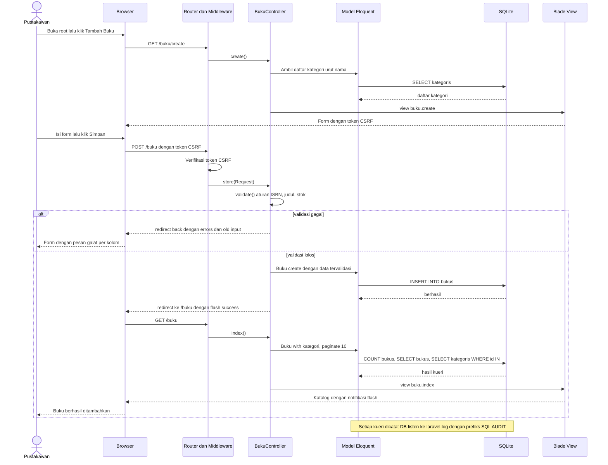
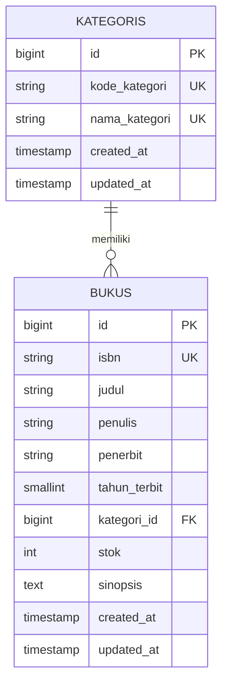

# PRD — SIPUS-Del (Sistem Informasi Perpustakaan Kampus Del)

## 1. **Overview**

SIPUS-Del adalah aplikasi web katalog perpustakaan Institut Teknologi Del berbasis *server-side rendering* dengan arsitektur *Model-View-Controller*. Pustakawan memakainya untuk mengelola data buku dan kategori. Mahasiswa dan dosen memakainya untuk menelusuri koleksi. Model bisnisnya *single-tenant*, internal, dan non-komersial. Aplikasi ini sekaligus menjadi tugas mandiri Minggu 5 mata kuliah 12S3101 PPW, sehingga setiap keputusan teknis harus bisa dibuktikan sesuai modul: relasi *Eloquent*, validasi *server-side*, proteksi CSRF, Blade *component*, dan audit kueri SQL.

**Masalah yang diselesaikan:** Data koleksi perpustakaan umumnya dicatat di *spreadsheet* atau buku manual. Akibatnya nomor ISBN tercatat ganda, jumlah stok tidak sinkron dengan kondisi rak, dan penulisan kategori tidak seragam ("Informatika", "informatika", "IF"). Mahasiswa yang mencari buku harus bertanya langsung ke pustakawan atau membuka berkas yang tidak terstruktur, sehingga waktu terbuang di kedua sisi. Dari sisi teknis, aplikasi yang mencampur kueri SQL, logika, dan HTML dalam satu berkas sulit dirawat dan rawan lambat karena *N+1 query*.

**Tujuan Utama:** Dari sisi pengunjung, katalog bisa dibuka dari ponsel, dicari berdasarkan judul, penulis, atau ISBN, difilter per kategori, dan menampilkan status ketersediaan buku dalam hitungan detik. Dari sisi pustakawan, data buku dan kategori dikelola lewat form yang menolak data tidak valid (ISBN ganda, stok negatif, judul terlalu pendek) sebelum masuk ke basis data. Dari sisi akademik, repositori menjadi bukti penerapan MVC, relasi *Eloquent*, dan *Eager Loading* dengan log SQL yang bisa diperiksa penilai.

## 2. **Requirements**

- **Arsitektur MVC Tegas:** *Model* hanya berisi struktur data, relasi, dan aturan bisnis. *Controller* hanya menerima *request*, memanggil *Model*, dan memilih *View*. *View* Blade tidak boleh memanggil `Buku::`, `Kategori::`, atau `DB::` secara langsung.
- **Versi Framework:** Proyek dibuat dengan `composer create-project laravel/laravel:^13.0 sipus-del`. Laravel 13 mensyaratkan PHP 8.3 atau lebih baru, sedangkan modul menyebut PHP 8.2. Alur *request lifecycle* (`public/index.php` → `bootstrap/app.php` → *middleware* → *routing* → *response*) tetap sama dengan materi modul.
- **Model Data & Integritas:** Hubungan *One-to-Many* Kategori → Buku diikat *foreign key* `kategori_id` dengan `restrictOnDelete`. ISBN unik di level basis data (*unique index*) dan di level validasi. Kategori yang masih memiliki buku tidak boleh dihapus; sistem menolaknya dengan pesan *flash* error yang jelas, bukan halaman error 500.
- **Eloquent ORM:** Model *Kategori* dan *Buku* memakai properti `$fillable` eksplisit (bukan `$guarded = []` dan bukan atribut PHP baru Laravel 13, agar sesuai modul). Relasi didefinisikan dua arah. Semua halaman *index* memakai *Eager Loading* (`Buku::with('kategori')`, `Kategori::withCount('bukus')`).
- **Routing RESTful:** `Route::resource('buku', BukuController::class)` dan `Route::resource('kategori', KategoriController::class)` menghasilkan tujuh aksi baku (*index, create, store, show, edit, update, destroy*) dengan *Implicit Route Model Binding* (`Buku $buku`, `Kategori $kategori`). Rute `/` melakukan *redirect* ke `buku.index`.
- **Validasi & Keamanan Web:** Semua `store` dan `update` memakai `$request->validate()`. Aturan wajib: ISBN unik, judul minimal 5 karakter, stok minimal 0. Setiap form menyertakan `@csrf`, dan form edit serta hapus menyertakan `@method('PUT')` atau `@method('DELETE')`. Keluaran memakai `{{ }}` saja, tanpa `{!! !!}`, agar bebas XSS. Pesan galat berbahasa Indonesia (`APP_LOCALE=id`, `lang/id/validation.php`).
- **Lingkup Terkunci:** Tanpa *authentication*, tanpa peminjaman dan pengembalian buku, tanpa unggah sampul, tanpa API JSON. Semua rute terbuka karena aplikasi hanya dijalankan lokal. Agen *coding* tidak boleh menambah fitur di luar daftar ini.
- **Desain Minimalis:** Satu warna aksen *Del Purple* `#4C1D95` (hover `#3B0764`), latar putih, teks abu gelap, garis tipis `#E5E7EB`. Font memakai *system font stack*. Sudut maksimal 4 px. Dilarang memakai gradien, bayangan, efek kaca, ikon dekoratif, emoji, ilustrasi, *hero section*, kartu statistik, dan animasi. Tampilan *mobile-first* dengan tabel yang bisa digulir horizontal.
- **Audit Kueri SQL:** `DB::listen` di `AppServiceProvider::boot()` mencatat setiap kueri ke `storage/logs/laravel.log` dengan prefiks `[SQL AUDIT]`, hanya saat `APP_ENV=local`. `SESSION_DRIVER=file` agar kueri sesi tidak mencemari log. Bukti dibuat dua tahap: versi *lazy loading* dulu, lalu versi *eager* setelah optimasi. Satu *feature test* opsional memastikan jumlah kueri halaman *index* tetap konstan berapa pun jumlah barisnya.
- **Repositori & Pengumpulan:** Repositori publik GitHub bernama `ppw-2026-week5-[NIM]`, memakai *Conventional Commits* sesuai modul. `.env` dan `vendor/` wajib masuk `.gitignore`. `.env.example` harus valid (`DB_CONNECTION=sqlite`), dan README memuat panduan instalasi serta bukti log audit SQL.

## 3. **Core Features**

- **Katalog Buku (CRUD Lengkap):** Halaman `/buku` menampilkan tabel ISBN, judul, penulis, kategori, tahun, dan status stok dengan *pagination* 10 data per halaman. Pustakawan dapat menambah, melihat detail, mengubah, dan menghapus buku. Hapus memakai konfirmasi sebelum dikirim.
- **Pencarian & Filter Katalog (tambahan ringan):** Satu kolom cari untuk judul, penulis, atau ISBN, ditambah *dropdown* filter kategori. Parameter dipertahankan antar halaman lewat `withQueryString()`, dan jumlah kueri tetap tiga.
- **Manajemen Kategori:** Halaman `/kategori` menampilkan kode, nama, dan jumlah buku per kategori (`withCount`). Halaman detail kategori menampilkan daftar bukunya. Penghapusan kategori yang masih berisi buku ditolak dengan pesan galat.
- **Form Tervalidasi:** Form dipakai bersama oleh halaman *create* dan *edit* lewat satu *partial*. Galat tampil di bawah tiap kolom lewat `@error`, dan input lama dipertahankan lewat `old()`. Dropdown kategori diisi dari *Controller*, bukan kueri di *View*.
- **Master Layout `<x-layout>`:** Satu komponen Blade berisi navigasi teks (SIPUS-Del, Buku, Kategori), *slot* konten, dan area notifikasi *flash session* (`success` dan `error`). Data kosong ditangani `@forelse` dengan satu kalimat dan tautan "Tambah buku pertama".
- **Seeder, Factory & Bukti Audit:** `php artisan migrate:fresh --seed` menghasilkan 5 kategori tetap dan 20 buku realistis (Faker `id_ID`, minimal 2 buku bersetok 0 agar status "Habis" terlihat). Hasil log SQL sebelum dan sesudah *Eager Loading* dilampirkan di README.

## 4. **User Flow**

**Pengunjung (Mahasiswa / Dosen) — Mencari Buku**
1. Membuka alamat aplikasi, lalu otomatis diarahkan ke `/buku`.
2. Mengetik kata kunci judul, penulis, atau ISBN pada kolom cari.
3. Memilih kategori pada *dropdown* filter bila perlu, lalu klik "Cari".
4. Membaca hasil pada tabel. Kolom status menunjukkan "Tersedia" atau "Habis".
5. Klik judul buku untuk membuka halaman detail (sinopsis, penerbit, tahun terbit, stok).
6. Berpindah halaman lewat *pagination*; kata kunci dan filter tetap terbawa.
7. Bila hasil kosong, muncul pesan data kosong dan tautan untuk menghapus filter.

**Pustakawan — Menambah Buku**
1. Membuka `/`, lalu diarahkan ke `/buku`.
2. Klik "Tambah Buku" untuk membuka `/buku/create`. Form tampil dengan *dropdown* kategori.
3. Mengisi ISBN (13 digit), judul, penulis, penerbit, tahun terbit, kategori, stok, dan sinopsis.
4. Klik "Simpan"; form dikirim dengan token CSRF.
5. Bila validasi gagal, sistem kembali ke form dengan pesan galat per kolom dan input lama, lalu pustakawan mengulang langkah 3.
6. Bila valid, buku disimpan, sistem *redirect* ke `/buku`, dan notifikasi "Buku berhasil ditambahkan." muncul.

**Pustakawan — Mengubah atau Menghapus Buku dan Kategori**
1. Pada tabel katalog, klik "Ubah" untuk membuka form berisi data lama, atau klik "Hapus" lalu setujui konfirmasi.
2. Pada *edit*, aturan unik ISBN mengabaikan buku yang sedang diubah, sehingga ISBN sendiri tidak dianggap duplikat.
3. Sistem menyimpan perubahan atau menghapus data, lalu menampilkan notifikasi *flash* di halaman daftar.
4. Pada `/kategori`, klik "Hapus" pada kategori yang masih memiliki buku. Sistem menolak dan menampilkan "Kategori masih memiliki buku dan tidak dapat dihapus."

**Mahasiswa Pengembang — Pembuktian Audit SQL dan Pengumpulan**
1. Menjalankan `php artisan migrate:fresh --seed`, lalu mengosongkan `laravel.log`.
2. Dengan *index* versi *lazy loading*, memuat `/buku` sekali dan menyimpan log (12 kueri untuk 10 baris: 1 `COUNT`, 1 `SELECT bukus`, 10 `SELECT kategoris`).
3. Menambahkan `with('kategori')`, mengosongkan log, memuat `/buku` lagi, dan menyimpan log (3 kueri).
4. Melampirkan kedua potongan log di README, lalu *commit* dengan pesan `perf(eager-loading): ...`.
5. Memastikan `.env` tidak ter-*track*, lalu *push* ke GitHub `ppw-2026-week5-[NIM]` dan mengumpulkan tautan repositori.

## 5. **Architecture**

Aplikasi dibangun dengan **Laravel 13** sebagai satu repositori *monolith* dengan *server-side rendering* lewat Blade. Pilihan ini sesuai tujuan modul: pemisahan MVC terlihat jelas pada struktur folder (`app/Models`, `app/Http/Controllers`, `resources/views`), tidak perlu *frontend* terpisah, dan seluruh siklus *request* dapat ditelusuri dari `public/index.php` sampai *response*. Karena ini tahap MVP dan tugas kuliah, basis data memakai SQLite satu berkas tanpa *server* tambahan. Aset CSS dikompilasi Vite. Tidak ada *multitenancy*; isolasi data tidak diperlukan karena hanya ada satu institusi. Konsistensi data dijaga *foreign key* `bukus.kategori_id → kategoris.id` (SQLite menjalankan *foreign key constraint* di Laravel secara bawaan).

Diagram berikut menggambarkan alur "Pustakawan Menambah Buku" dari User Flow:

## 6. **Database Schema**

Hierarki data sederhana: **Kategori → Buku** (*One-to-Many*). Satu kategori memiliki banyak buku, dan setiap buku wajib berada di tepat satu kategori. Tabel bawaan Laravel (`users`, `sessions`, `cache`, `jobs`, dan sejenisnya) tidak dimodifikasi dan tidak digambarkan di ERD. Nama tabel mengikuti konvensi *pluralization* Laravel (model `Kategori` → `kategoris`, `Buku` → `bukus`), sehingga properti `$table` tidak perlu ditulis.

1. **`Kategori (kategoris)` - pengelompokan koleksi berdasarkan bidang ilmu**
   - `id` (BIGINT UNSIGNED): *Primary Key*, *auto increment*.
   - `kode_kategori` (VARCHAR 10): kode singkat huruf kapital, misal `INF`, `ELK`. *Unique index*.
   - `nama_kategori` (VARCHAR 100): nama kategori, misal "Informatika dan Komputer". *Unique index* agar tidak ada penulisan ganda.
   - `created_at`, `updated_at` (TIMESTAMP, nullable): dikelola otomatis oleh *Eloquent*.

2. **`Buku (bukus)` - entri koleksi perpustakaan**
   - `id` (BIGINT UNSIGNED): *Primary Key*, *auto increment*.
   - `isbn` (VARCHAR 13): ISBN-13 tanpa tanda hubung. *Unique index* untuk mencegah duplikasi.
   - `judul` (VARCHAR 200): judul buku, minimal 5 karakter pada validasi. *Index* biasa untuk pengurutan dan pencarian.
   - `penulis` (VARCHAR 150): nama penulis atau penulis utama.
   - `penerbit` (VARCHAR 100): nama penerbit.
   - `tahun_terbit` (SMALLINT UNSIGNED): tahun empat digit, divalidasi antara 1900 dan tahun berjalan.
   - `kategori_id` (BIGINT UNSIGNED): *Foreign Key* ke `kategoris.id`, `restrictOnDelete`, ber-*index* otomatis.
   - `stok` (INT UNSIGNED, default 0): jumlah eksemplar, minimal 0.
   - `sinopsis` (TEXT, nullable): ringkasan isi buku, maksimal 2000 karakter pada validasi.
   - `created_at`, `updated_at` (TIMESTAMP, nullable).
   - **Status ketersediaan (turunan, bukan kolom):** *accessor* `status_stok` bernilai `Tersedia` bila `stok > 0` dan `Habis` bila `stok = 0`. Status tidak disimpan sebagai kolom agar skema tetap sama dengan spesifikasi modul dan tidak mungkin tidak sinkron dengan `stok`. Perubahan status terjadi otomatis saat pustakawan mengubah stok lewat form.

## 7. **Tech Stack**

- **Framework Fullstack:** **Laravel 13 (PHP 8.3+)** — MVC, *routing*, validasi, dan Blade sudah bawaan sehingga cocok dengan tujuan modul. Satu repositori, tanpa *frontend* terpisah, karena ini tahap MVP.
- **Styling/UI:** **Tailwind CSS 4 + Vite + Blade Components** — Tailwind dan Vite sudah ada di *skeleton* Laravel, jadi tidak perlu CDN atau pustaka UI tambahan. Warna `#4C1D95` didaftarkan sebagai *design token* di `resources/css/app.css`. Perlu satu baris `@source` agar *view* pagination bawaan Laravel ikut terkompilasi, dan JavaScript hanya dipakai untuk dialog konfirmasi hapus.
- **Database:** **SQLite** — satu berkas `database/database.sqlite` tanpa *server* tambahan, cukup untuk MVP dan penilaian tugas. Berkas ini tidak di-*commit*, dan data dibuat ulang lewat `migrate:fresh --seed`.
- **ORM:** **Eloquent ORM** — *Active Record* bawaan Laravel dengan *Eager Loading* dan *query builder* berparameter, sehingga relasi mudah ditulis dan aman dari SQL *injection*.
- **Autentikasi:** **Tidak digunakan** — di luar lingkup modul dan tidak ada di checklist penilaian. Karena aplikasi hanya berjalan lokal, menambahkannya hanya memperbesar risiko bug di tahap awal.
- **Deployment:** **Lokal (`php artisan serve` + `npm run build`) dan GitHub publik** — tidak ada *hosting* produksi. Langkah instalasi di README: `composer install`, `cp .env.example .env`, `php artisan key:generate`, buat `database/database.sqlite`, `php artisan migrate:fresh --seed`, `npm install && npm run build`, `php artisan serve`.
